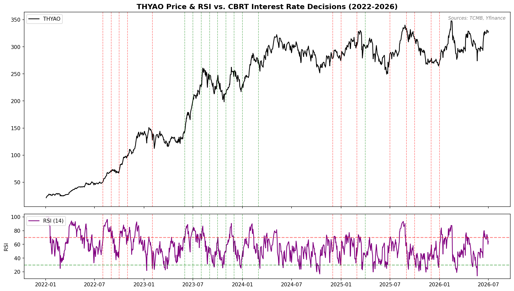

# THYAO RSI and CBRT Interest Rate Decisions

This project visualizes Turkish Airlines (THYAO) stock price and its 
14-day RSI alongside CBRT interest rate decisions between 2022-2026.

## Findings
The period when the CBRT shifted to orthodox monetary policy (rate hikes, 
shown in green) overlaps with THYAO's strongest upward momentum. This is 
not a direct causal link — rather, both reflect the same macroeconomic 
stabilization: improved investor confidence and a more stable lira, which 
benefits THYAO's dollar-based revenue model.

## Data Sources
- CBRT interest rate data: EVDS API
- THYAO stock price: Yahoo Finance API

## Libraries
pandas, matplotlib, evds, yfinance, python-dotenv

## Chart

